# flutter_flight_reservation_app

## Note: In this project, payment system and database are not integrated. If you want these things you can add.

### Login Screen
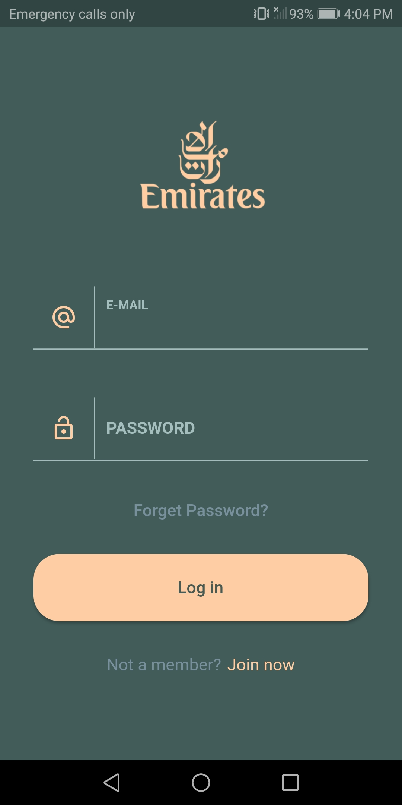 

### SignUp Screen before and after adding data
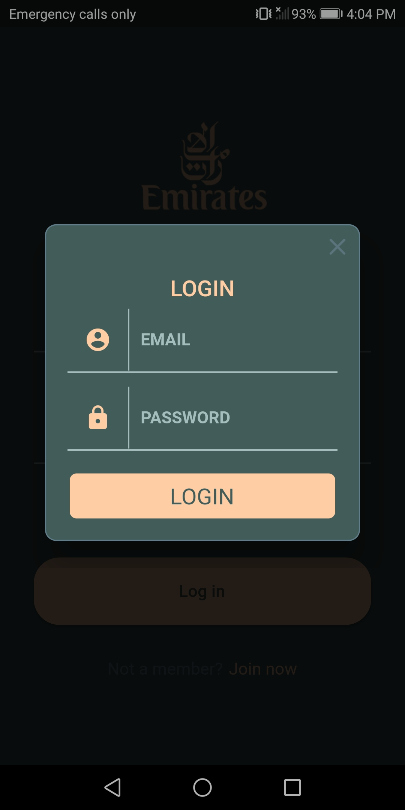 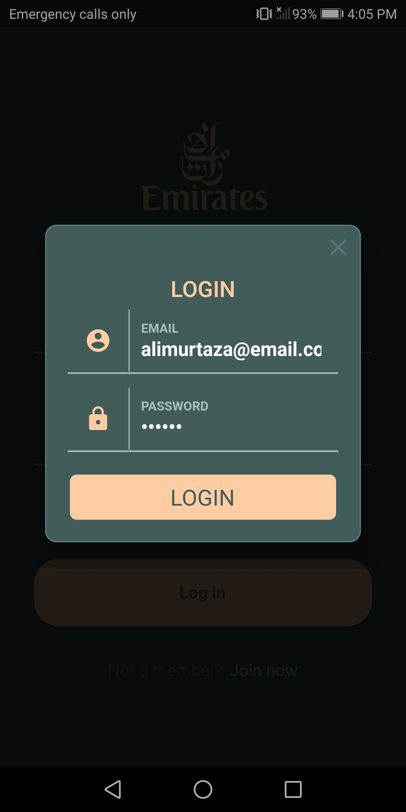 

### Main Screen before adding profile.
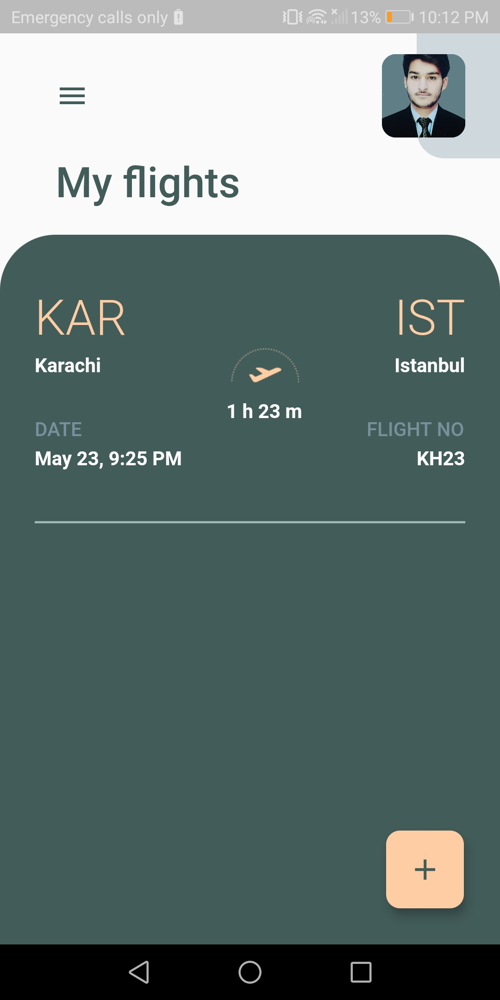 

### Drawer before changing profile
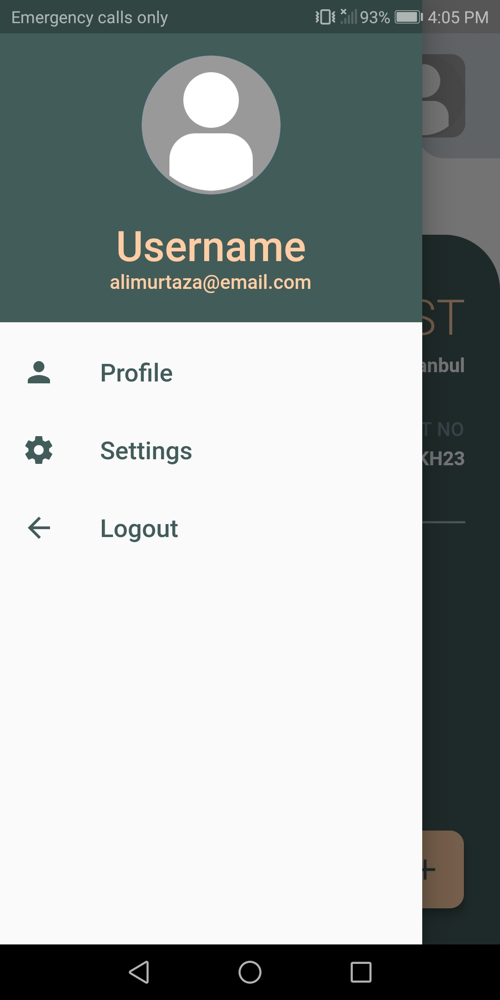 

### Profile Screen before changes and after changes.
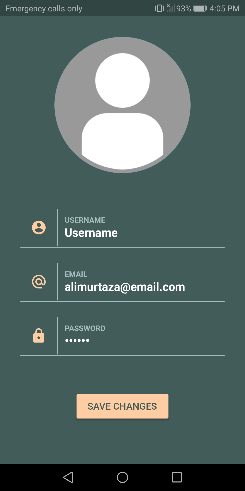 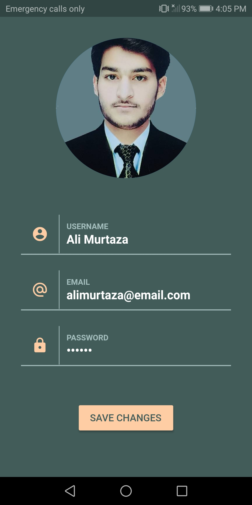 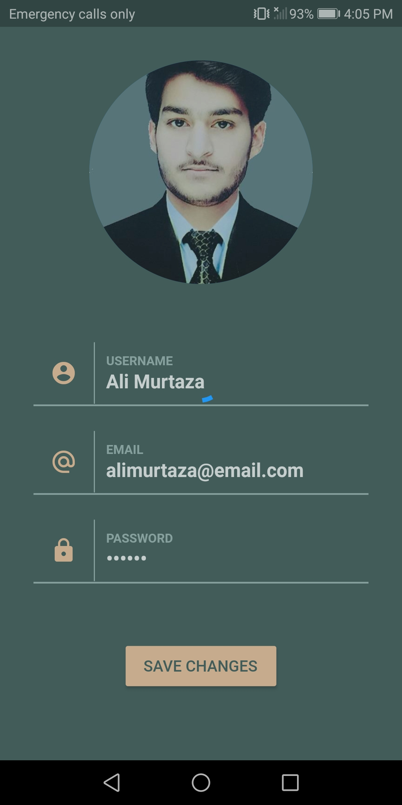 

### Drawer Screen after changes
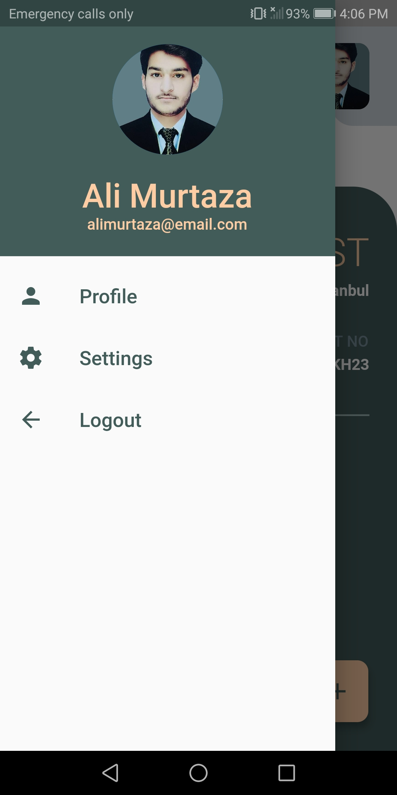 

### Route Tab, date Picker and Error Dialog
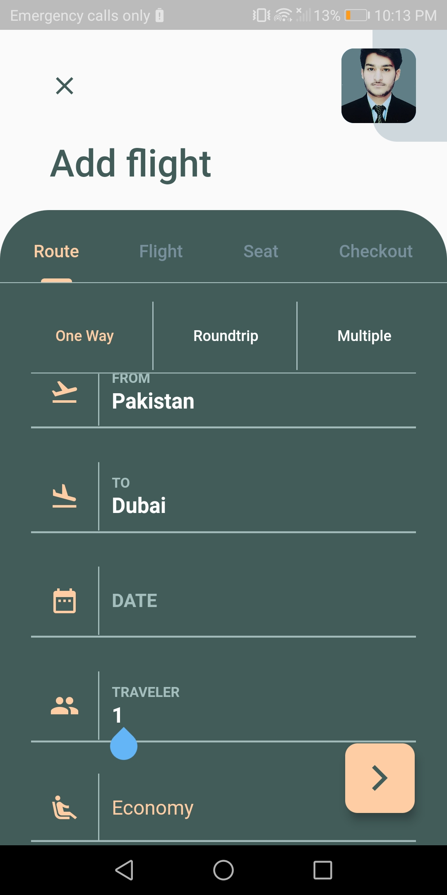  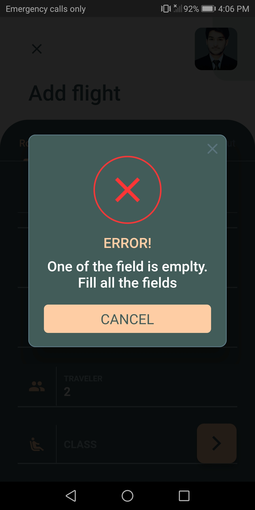

### Flight Screen
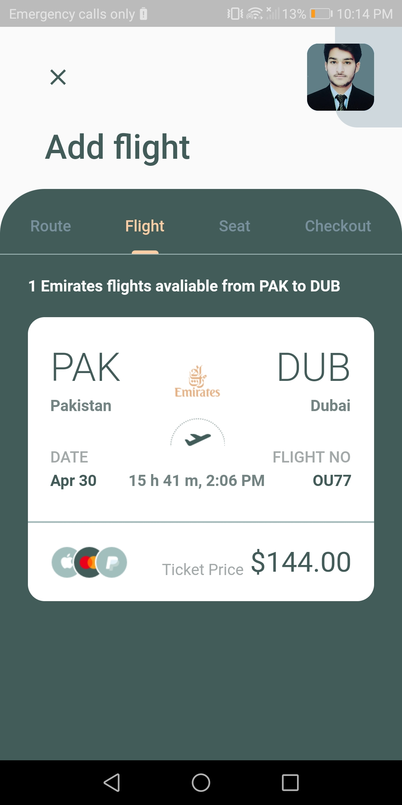 

### Seat Screen before and after selecting seat and Error Dialog.
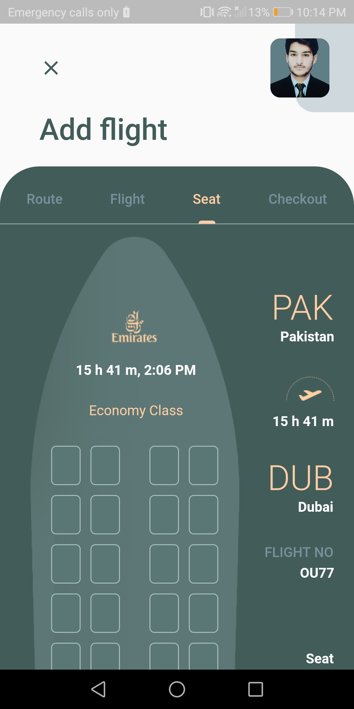 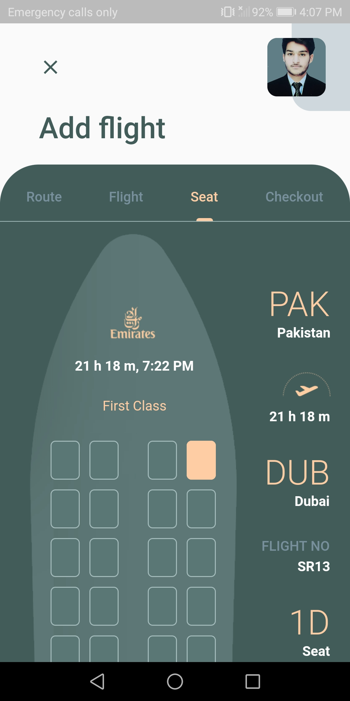 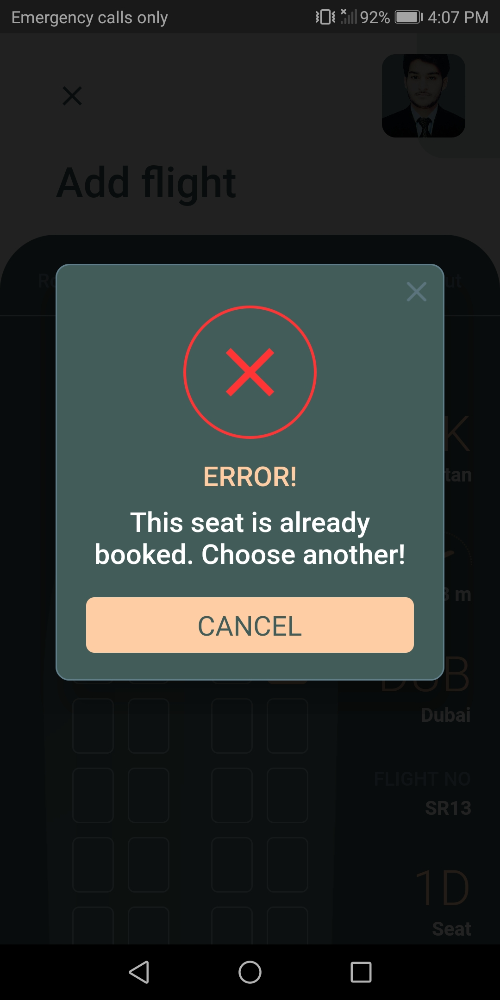 

### Checkout Screen
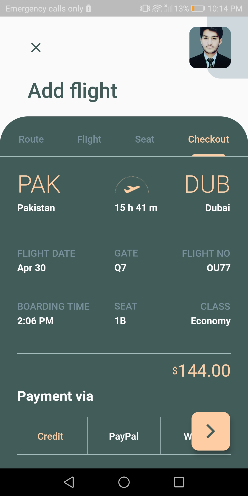 

### Main Screen After adding ticket
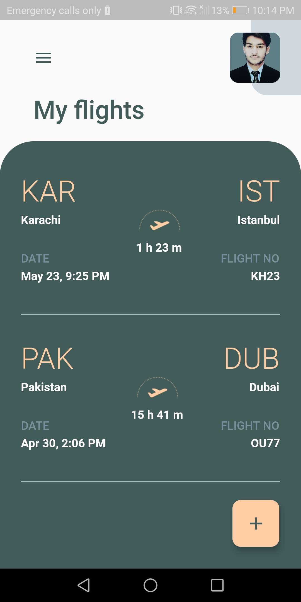 
