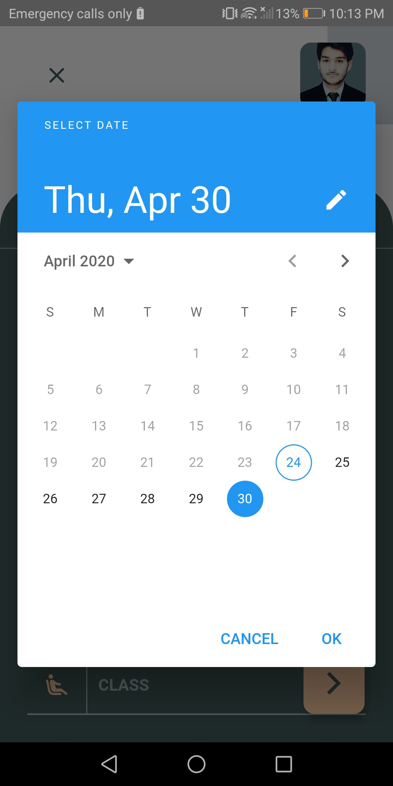
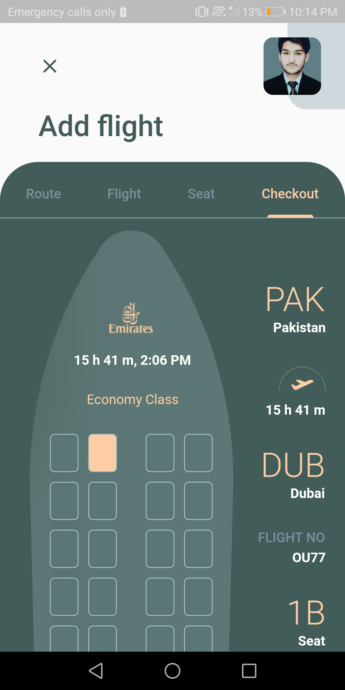
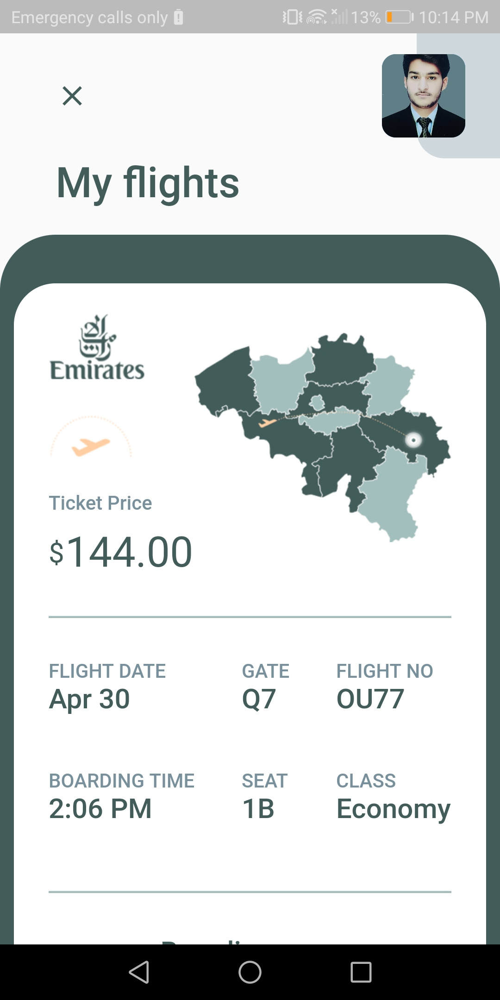
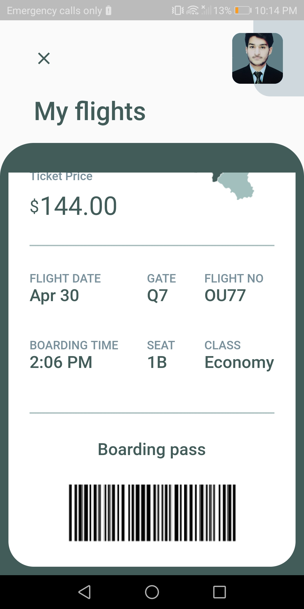

# flutter_flight_reservation_app

## Note: This project is not completed yet. I have uploaded this for some reason. So please don't use this.

### Main Screen before adding Ticket
 

### Route Tab for adding route details
 

### Data Picket when user click date text field

### Flight Tab shows the available tickets 
 

### Seat Tab before selecting ticket

### Seat Tab after selecting ticket

### Checkout Tab contains all details and also payment option is here

### Main Screen after adding a ticket
 

### When user tab the ticket on main screen, boarding pass will show like this.

### the same bottom part of boarding pass screen

